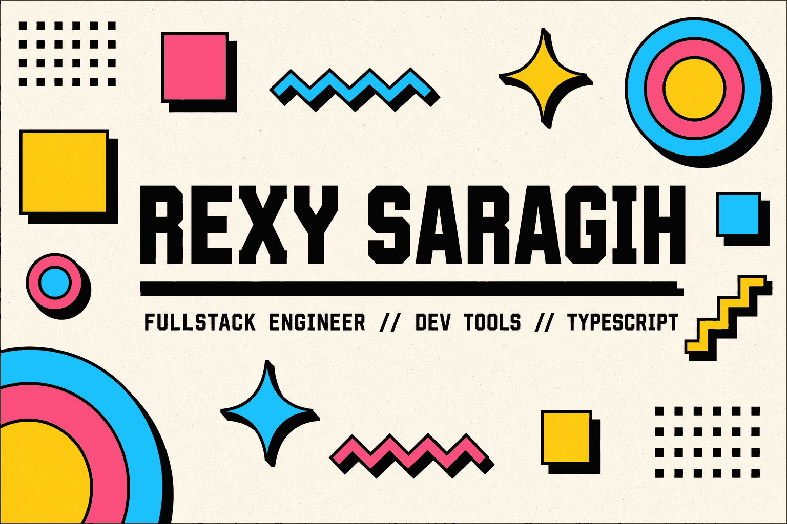
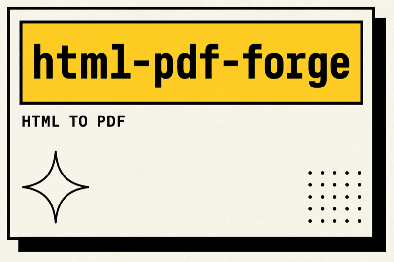
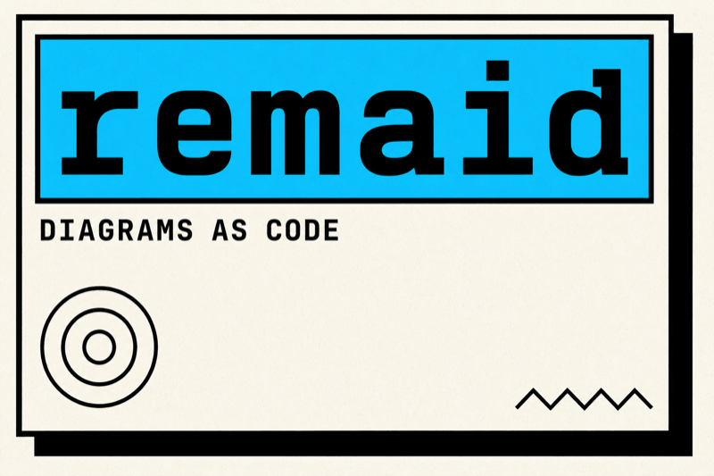
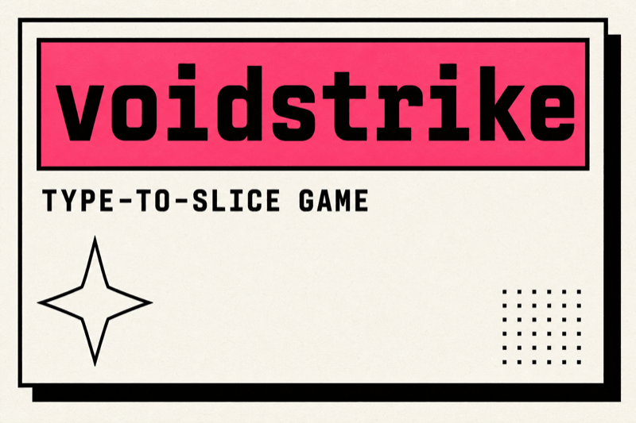
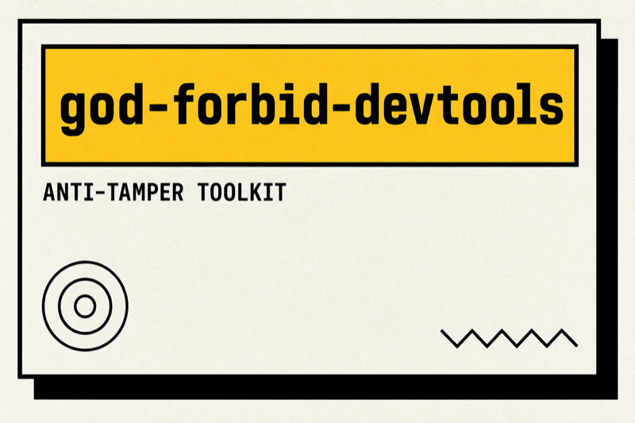
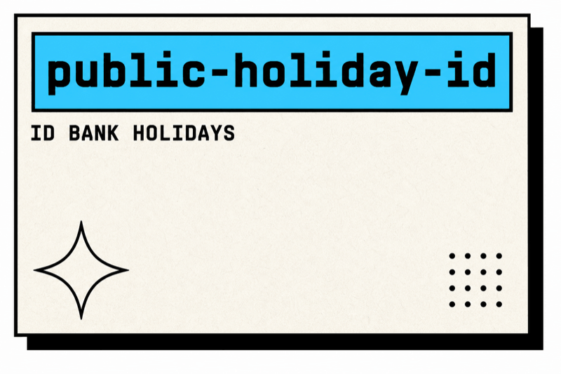
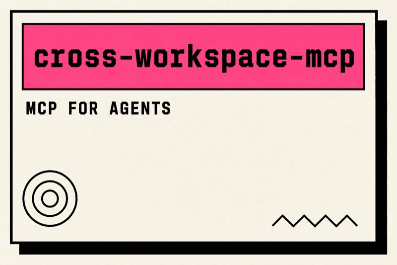

<p align="center">
  <a href="https://www.rexy-jms.dev/">
    
  </a>
</p>

<p align="center">
  <a href="https://www.rexy-jms.dev/"></a>
  <a href="https://www.npmjs.com/~rexy_mayderio"></a>
  <a href="https://www.linkedin.com/in/rexy-jms"></a>
  <a href="https://www.instagram.com/rexy.jms"></a>
</p>

```typescript
class RexySaragih implements FullstackEngineer {
  readonly name = "Rexy Saragih";
  readonly role = "Fullstack Engineer";
  readonly based = "Indonesia";

  readonly thrivesAt = [
    "backend reliability",
    "frontend craft",
    "creative side projects",
  ] as const;

  readonly stack = {
    languages: ["TypeScript", "JavaScript", "SQL"],
    frontend: ["React", "Next.js"],
    backend: ["Node.js", "PostgreSQL"],
    ships: ["npm packages", "MCP servers", "the occasional game"],
  };

  build(): "developer tools nobody asked for, then everybody uses" {
    return "developer tools nobody asked for, then everybody uses";
  }
}
```

## `// THINGS I BUILT`

<table>
  <tr>
    <td width="50%" valign="top">
      <a href="https://html-pdf-forge.rexy-jms.dev/">
        
      </a>
    </td>
    <td width="50%" valign="top">
      <a href="https://remaid.rexy-jms.dev/">
        
      </a>
    </td>
  </tr>
  <tr>
    <td width="50%" valign="top">
      <a href="https://voidstrike.rexy-jms.dev/">
        
      </a>
    </td>
    <td width="50%" valign="top">
      <a href="https://www.npmjs.com/package/@rexymayderio/god-forbid-devtools">
        
      </a>
    </td>
  </tr>
  <tr>
    <td width="50%" valign="top">
      <a href="https://www.npmjs.com/package/id-bank-holidays">
        
      </a>
    </td>
    <td width="50%" valign="top">
      <a href="https://www.npmjs.com/package/@rexymayderio/cross-workspace-mcp">
        
      </a>
    </td>
  </tr>
</table>

## `// MCP SERVERS`

<p>
  i build <a href="https://modelcontextprotocol.io/">Model Context Protocol</a> servers so agents can reach the tools i actually use:
</p>

<p align="center">
  <a href="https://github.com/RexySaragih/mcp-confluence"></a>
  <a href="https://github.com/RexySaragih/mcp-pgsql"></a>
  <a href="https://github.com/RexySaragih/mcp-bitbucket"></a>
  <a href="https://github.com/RexySaragih/mcp-bruno"></a>
  <a href="https://github.com/RexySaragih/cross-workspace-mcp"></a>
  <a href="https://github.com/RexySaragih/tomarkdamnit"></a>
</p>

## `// WHAT I BUILD WITH`

<p align="center">
  
  
  
  
  
</p>

## `// GET IN TOUCH`

<p align="center">
  <a href="https://www.rexy-jms.dev/"></a>
  <a href="https://www.npmjs.com/~rexy_mayderio"></a>
  <a href="https://www.linkedin.com/in/rexy-jms"></a>
  <a href="https://www.instagram.com/rexy.jms"></a>
</p>

<p align="center">
  <picture>
    <source media="(prefers-color-scheme: dark)" srcset="https://github-readme-stats.vercel.app/api/top-langs/?username=RexySaragih&layout=compact&langs_count=8&hide_border=true&bg_color=00000000&title_color=ffd23f&text_color=c9d1d9" />
    
  </picture>
</p>

<p align="center">
  <em>currently building at <a href="https://www.rexy-jms.dev/">rexy-jms.dev</a>.</em>
</p>
